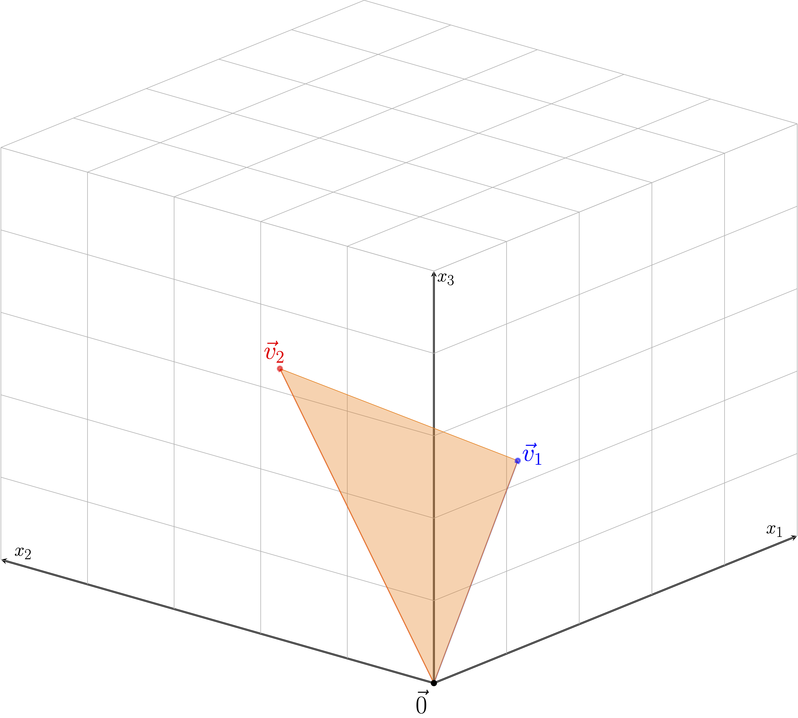

# Kernel Methods and Manifold Learning {#ch-nonlinear}

## Kernels and the Kernel Trick

The techniques considered in the previous chapter (PCA, NMF, SVD, and classical Scaling) are ill suited to identify nonlinear structure and dependence in data.  If we wish to most efficiently reduce dimensions without loss of information, we will need techniques which incorporate nonlinear structure.  One can expand a data matrix by including specific nonlinear relationships then apply PCA or SVD but there are numerous problems with this approach.  In particular, which relationships does one choose to include? Even including simple quadratic or cubic terms (features) can result in a data matrix with a massive increase in the number of columns. Even when the original dimensionality of the data is moderate, the including of polynomial terms can quickly result in a data matrix of nonlinear features with an untenable number of columns which can make application of the linear methods we have discussed much more computationally demanding to implement.

Kernels are a important class of functions which can be used to `kernelize` the methods we have discussed before. In theory, these kernelized versions of the linear methods we have discussed can identify and use nonlinear structure for better dimensionality reduction while circumventing the issue of higher dimensional `featurized` data.  This approach follows from an application of the so called 'kernel trick` which we now discuss.

Briefly, a kernel is a function $$k:\mathbb{R}^d\times \mathbb{R}^d \to \mathbb{R}$$ which has an associated  feature space, $\mathcal{H}$ and (implicity defined, possibly nonlinear) feature mapping $\varphi:\mathcal{R}^d \to \mathcal{H}$ such that inner products in the feature space, denoted $\langle \varphi(\vec{x}), \varphi(\vec{y})\rangle_{\mathcal{H}}$ can be obtained through an evaluation of the kernel, namely
\begin{equation}
k(\vec{x},\vec{y}) = \langle \varphi(\vec{x}), \varphi(\vec{y})\rangle_{\mathcal{H}}
\end{equation}

Any method which can be expressed involving inner products can be kernelized by replacing terms of the form $\vec{x}^T_i\vec{x}_j$ with the quantity $k(\vec{x}_i,\vec{x}_j)$. Thus, we are replacing inner products of our original $d$-dimensional data with inner products in the associated feature space $\mathcal{H}$.  Importantly, if we only need inner products, we never need to explicitly compute the feature map $\varphi$ for any of our data!  At first glance this connection may seem minor, but by using kernels we can turn many linear techniques into nonlinear methods including PCA, SVD, support vector machines, linear regression, and many others.

There are some limits though. Not every choice of $k$ has an associated feature space. A function is only a kernel if it satisfies Mercer's Condition.

::: {.theorem #mercer name="Mercer's Condition"}
A function $$k:\mathbb{R}^d\times \mathbb{R}^d \to \mathbb{R}$$ has a an associated feature space $\mathcal{H}$ and feature mapping $\varphi:\mathbb{R}^d \to \mathcal{H}$ such that $$k(\vec{x},\vec{y}) = \langle \varphi(\vec{x}), \varphi(\vec{y})\rangle_{\mathcal{H}}, \qquad \forall \vec{x},\vec{y}\in\mathbb{R}^d$$
if and only if for any $N \in \{1,2,\dots\}$ and $\vec{x}_1,\dots,\vec{x}_N\in\mathbb{R}^d$ the kernel matrix ${\bf K}\in \mathbb{R}^{N}$ with entries ${\bf K}_{ij} = k(\vec{x}_i,\vec{x}_j)$ is positive semidefinite.  Equivalently, it must be the case that $$\int_{\mathbb{R}^d}\int_{\mathbb{R}^d} g(\vec{x})g(\vec{y}) k(\vec{x},\vec{y}) d\vec{x}d\vec{y} \ge 0$$ whenever $\int_{\mathbb{R}^2}[g(\vec{x})]d\vec{x}<\infty.$
:::

We will only consider symmetric functions such that $k(\vec{x},\vec{y}) = k(\vec{y},\vec{x})$ for all $\vec{x},\vec{y}\in\mathbb{R}^d$.  It may not be immediately obvious if a symmetric function satisfies Mercer's condition, but there are many known examples. A few are shown in the following table.

| Name | Equation | Tuning Parameters |
|------|----------|-------------------|
| Radial Basis Function | $k(\vec{x},\vec{y} = \exp\left(-\sigma\|\vec{x}-\vec{y}\|^2\right)$  | Scale $\sigma >0$ |
| Laplace | $k(\vec{x},\vec{y} = \exp\left(-\sigma\|\vec{x}-\vec{y}\|\right)$  | Scale $\sigma >0$ |
| Polynomial | $k(\vec{x},\vec{y}) = (c+ \vec{x}^T\vec{y})^d$ | Offset $c >0$, Degree $d \in \mathbb{N}$ |


The radial basis function (rbf) is the most commonly used kernel and has an associated feature space $\mathcal{H}$ which is infinite dimensional! The associated feature map $\varphi$ for the rbf kernel is
$$\varphi(\vec{x}) = e^{-\sigma\|\vec{x}\|^2}\left(a_{\ell_0}^{(0)}, a_{1}^{(1)},\dots,a_{\ell_1}^{(1)}, a_{1}^{(2)},\dots, a_{\ell_2}^{(2)},\dots \right)$$
where $\ell_j = \binom{d+j-1}{j}$ and $a_\ell^{(j)} = \frac{(2\sigma)^{j/2}x_1^{\eta_1}\dots x^{\eta_d}}{\sqrt{\eta_1!\dots\eta_d!}}$ when $\eta_1+\dots+\eta_d = j.$  The preceding expression is quite cumbersome, but there is one important point to emphasize.  Every possible polynomial combination of the coordinates of $\vec{x}$ appears in some coordinate of $\varphi(\vec{x})$ (though higher order terms are shrunk by the factorial factors in the denominator of $a_\ell^{(j)}$).  Thus, the rbf kernel is associated with a very expressive feature space which makes it a potent but dangerous choice since risks overfitting.  To explore these details more, let's discuss one very important application of kernels in unsupervised learning.

<!-- kernel PCA -->
```{r child = 'topics/kPCA.Rmd'}
```

## The Manifold Hypothesis

In the preceding section, we focused our attention on linear manifolds and saw cases where this structure was insufficient.  Using kernel PCA, we tried to find a workaround by first (implicity) mapping our data to a higher dimensional feature space then approximating results with linear subspaces (of feature space). In this Chapter, we will investigate several methods to estimate a lower-dimensional representation assuming the data live on a manifold, which we hereafter refer to as the manifold hypothesis. This hypothesis is the central assumptions of modern nonlinear dimension reduction methods and can be stated as follows.

::: {.definition name="Manifold Hypothesis"}
The observed data $\vec{x}_1,\dots,\vec{x}_N\in\mathbb{R}$ are concentrated on or near a manifold of intrinsic dimension $t\ll d.$
:::

In the following sections, we will provide more background on the mathematical foundation of nonlinear manifolds. Specifically, what is a manifold (and what is not) and what do we mean by intrinsic dimensionality.  We'll also touch on important properties which guides the assumptions used by various methods of nonlinear dimension reduction. For now, let's discuss a simple mechanism for generating data on a manifold.

Assume there are points $\vec{z}_1,\dots,\vec{z}_N\in A \subset \mathbb{R}^t$ which are *iid* random samples from some probability distribution. These points are (nonlinearly) mapped into a higher dimensional space $\mathbb{R}^d$ by a smooth map $\Psi$ giving data $\vec{x}_i = \Psi(\vec{z}_i)$ for $i=1,\dots,N.$   Hereafter, we refer to $\Psi$ as the manifold map.  In this setting, we are only given $\vec{x}_1,\dots,\vec{x}_N$, and we want to recover the lower-dimensional $\vec{z}_1,\dots,\vec{z}_N$. If possible, we would also like recover $\Psi$ and $\Psi^{-1}$ and in the most ideal case, the sampling distribution that generated the lower-dimensional coordinates $\vec{z}_1,\dots,\vec{z}_N$. 

::: {.example #ex-swiss-roll name="Mapping to the Swiss Roll"}
Let $A = (\pi/2,9\pi/2)\times (0,15)$.  We define the map $\Psi:A\to \mathbb{R}^3$ as follows
$$\Psi(\vec{z}) = \Psi(z_1,z_2) = \begin{bmatrix} z_1\sin(z_1) \\ z_1\cos(z_1) \\ z_2 \end{bmatrix}$$
Below we show $N=10^4$ \emph{iid} samples which are drawn uniformly from $A$.  We then show the resulting observations after applying map $\Psi$ to each sample.
```{r, echo = FALSE}
N <- 1e4
myColorRamp <- function(colors, values) {
    v <- (values - min(values))/diff(range(values))
    x <- colorRamp(colors)(v)
    rgb(x[,1], x[,2], x[,3], maxColorValue = 255)
}
library(scatterplot3d)
S <- matrix(NA, nrow = N, ncol = 2)
Swiss <- matrix(NA, nrow = N, ncol = 3)
for( n in 1:N){
    s <- runif(1, min = pi/2, max = 9*pi/2)
    t <- runif(1, min = 0,      max = 15)
    S[n,] <- c(s,t)
    Swiss[n, ] <- c( s*sin(s), s*cos(s),t )
}
par(mfrow = c(1,2))
plot(S[,1],S[,2],
     xlab = expression(z[1]), ylab = expression(z[2]),
     main = "Low-Dimensional Samples",
     cex = 0.1)
scatterplot3d(Swiss, color = myColorRamp(c("red","purple","blue","green","yellow"), S[,1] ),
               xlab = expression(x[1]), ylab = expression(x[2]), zlab = expression(x[3]),
              angle = 90,
              main = "Samples after applying \nthe Manifold Map",
              cex.symbols = 0.5)
```
:::


We may also consider the more complicated case where the observations are corrupted by additive noise.  In this setting, the typical assumption is that the noise follows after the manifold map so that our data are $$\vec{x}_i = \Psi(\vec{z}_i) + \vec{\epsilon}_i, \qquad i = 1,\dots, N$$ for some \emph{iid} noise vectors $\{\vec{\epsilon}_i\}_{i=1,\dots,N}.$  

::: {.example #ex-swiss-w-noise name="Swiss Roll with Additive Gaussian Noise"}

Here, we perturb the observations in the preceding example with additive $\mathcal{N}(\vec{0},0.1{\bf I})$ noise.

```{r, echo = FALSE, warning = FALSE, message = FALSE}
library("threejs")
scatterplot3js(Swiss+matrix(rnorm(prod(dim(Swiss)),mean = 0,sd = 0.5), nrow = nrow(Swiss)), color = myColorRamp(c("red","purple","blue","green","yellow"), S[,1] ),
               xlab = expression(x[1]), ylab = expression(x[2]), zlab = expression(x[3]),
              angle = 90,
              main = "Swiss Roll Data Perturbed by Additive Noise", 
              pch = '.',
              size = 0.1)
```
:::

In addition to the goals in the noiseless case, we may also add the goal of learning the noiseless version of the data which reside on a manifold.


However, there are a number of practical issues to this setup.  First, the dimension, $t$, of the original lower-dimensional points is typically unknown.  Similar to previous methods, we could pick a value of $t$ with the goal of visualization, base our choice off of prior knowledge, or run our algorithms different choices of $t$ and compare the results.  More advanced methods for estimating the true value of $t$ are an open area of research [@dim_est1].  

There is also a issue with the uniqueness problem statement.  Given only the high dimensional observations, there is no way we could identify the original lower-dimensional points without more information.  In fact, one could find an unlimited sources of equally suitable results.  

Let $\Phi:\mathbb{R}^t\to\mathbb{R}^t$ be an invertible function.  As an example, you could think of $\Phi$ as defining a translation, reflection, rotation, or some composition of these operations akin to the nonuniqueness issue we addressed in classical scaling.  If our original observed data are $\vec{x}_i = \Psi(\vec{z}_i)$, our manifold learning algorithm could instead infer that the manifold map is $\Psi \circ \Phi^{-1}$ and the lower-dimensional points are $\Phi(\vec{z}_i)$. This is a perfectly reasonable result since $(\Psi\circ \Phi^{-1})\circ\Phi(\vec{z}_i) = \Psi(\vec{z}_i)= \vec{x}_i$ for $i=1,\dots,N$, which is the only result we require.  Without additional information, there is little we could do to address this issue.  For the purposes of visualization, however, we will typically be most interested in the relationship between the lower-dimensional points rather than their specific location or orientation.  As such, we need not be concerned about a manifold learning algorithm that provides a translated or rotated representation of $\vec{z}_1,\dots,\vec{z}_N.$ More complicated transformations of the lower-dimensional coordinates are of greater concern and may be addressed through additional assumptions about the manifold map $\Psi.$

In the following sections, we will review a small collection of different methods which address the manifold learning problem.  Many of the methods are motivated based on important concepts from differential geometry, the branch of mathematics focused on manifolds.  Many of the details of differential geometry are beyond the scope of this book, so we will focus on a few key ideas here. For the more mathematically-minded reader, see [@spivak;@jm_lee].


## Brief primer on manifolds {#sec-manifolds}
While our data may exhibit some low-dimensional structure, there is no practical reason to expect such behavior to be inherently linear.   In the resulting sections, we will explore methods which consider **nonlinear** structure and assume the data reside on or near a manifold.  Such methods are referred to as nonlinear dimension reduction or manifold learning.  Critical to this discussion is the notion of a manifold.

::: {.definition #def-manifold name="Informal Definition of a Manifold"}
A manifold is a (topological) space which locally resembles Euclidean space.  Each point on a $t$-dimensional manifold has a neighborhood that can be mapped continuously to $\mathbb{R}^t$. We call $t$ the intrinsic dimension of the manifold.
:::


We'll return to mathematical details shortly, but let's stick with intuition for now.  If you were to stand at any point on a $k$-dimensional manifold, the portion of the manifold closest to you look just like a $k$-dimensional hyperplane -- though you might need to be extremely near-sighted for this to be true. The canonical example is the surface of the Earth. If we take all points on the surface of the Earth, they form a sphere in $\mathbb{R}^3$.  However, if we focus on the area around any point it looks like a portion of the two-dimensional plane.  In fact, we can represent any point on the surface of the Earth in terms of two numbers, latitude and longitude.  In the language of manifolds, we can say the surface of the Earth is a manifold with intrinsic dimension two which has been embedded in $\mathbb{R}^3$.  Here are a few more concrete examples.

::: {.example #ex-manifolds name="Examples of Manifolds"}
Many familiar geometric objects are manifolds such as lines, planes, and spheres.  For example,
Let $\vec{w}_1,\dots,\vec{w}_k\in\mathbb{R}^d$ be a set of linearly independent vectors. Then $\text{span}(\vec{w}_1,\dots,\vec{w}_k)$ is a $k$-dimensional manifold in $\mathbb{R}^d.$ When $k=1$, the span is a line; for $k>1$ the span is a hyperplane.  The sphere unit sphere $\{\vec{x}\in\mathbb{R}^d:\,\|\vec{x}\|=1\}$ is a $d-1$ dimensional manifold.  For example, when $d=3$ manifold resembles the surface of the earth which locally looks like a portion of the 2-dimensional plane.  The swiss roll example above is a two-dimensional manifold in $\mathbb{R}^3$.
:::

In short manifold as a nice smooth, curved surface. There are several reasons why a subset may not be a manifold.  The most straightforward examples are cases where the manifold as a self intersection or a sharp point.

::: {.example #ex-non-manifold name="Non-manifold"}
Consider a figure eight curve.  At the midpoint where the upper and lower circle meet, there is not neighborhood that resembles Euclidean space so the surface is not a manifold. 

For a second example, take any two vectors $\vec{h}_1$ and $\vec{h}_2$ and consider there convex hull, that is $\{a\vec{h}_1+b\vec{h}_2: a,b > 0, a+b\le 1\}$ such the orange triangle in the figure below.  At the three vertices of the orange triangle, there is no local neighbor that looks flat. However, if we were to exclude the edges and vertices of the triangle, the subset would be a two-dimensional manifold; thus, $\{a\vec{h}_1+b\vec{h}_2: a,b > 0, a+b< 1\}$ is a manifold while $\{a\vec{h}_1+b\vec{h}_2: a,b > 0, a+b\le 1\}$ is not.

```{r, echo = FALSE, fig.align='center',out.width="60%"}

```
:::

### Charts, atlases, tangent spaces and approximating tangent planes

Hereafter, we will focus on manifolds which are a subset of $\mathbb{R}^d$, which are often referred to as submanifolds.  Differential geometry can be made far more abstract, but that is unnecessary for the discussion here.  After all, we're dealing with finite dimensional data so any nonlinear surface containing our data must be a submanifold of $\mathbb{R}^d$!  

Now, some mathematical foundation.  Let $\mathcal{M}$ be a manifold in $\mathbb{R}^d$ with intrinsic dimension $t<d$.  For every point $\vec{x}\in\mathcal{M}$, there is a neighborhood $U_x\subset \mathcal{M}$ containing $\vec{x}$ and a function $\phi_x: U_x \to \phi_x(U_x) \subset \mathbb{R}^t$ which is continuous, bijective, and has continuous inverse (a *homeomorphism* if you like greek). The pair $(U_x,\phi_x)$ is called a chart and behaves much like a map of the area around $\vec{x}$. There are many choices for $\phi_x$, but we can always choose one which maps $\vec{x}\in\mathbb{R}^d$ to the origin in $\mathbb{R}^t$.  For vectors $\vec{z}\in U_x$, we call $\phi_x(\vec{z})\in\mathbb{R}^t$ the *local* coordinates of $\vec{z}.$

:::{.example name="Charts and Manifold Maps"}
Let's revisit the swiss roll example from the previous section where $A = (\pi/2,9\pi/2)\times (0,15)$.  We defined the map $\Psi:A\to \mathbb{R}^3$ as follows
$$\Psi(\vec{z}) = \Psi(z_1,z_2) = \begin{bmatrix} z_1\sin(z_1) \\ z_1\cos(z_1) \\ z_2 \end{bmatrix}.$$
For other manifolds, we may need multiple charts to cover the manifold, but we only need one chart the swiss roll (or any manifold defined through a homeomorphic manifold map).   Let the neighborhood be the entire manifold, i.e. $U = \mathcal{M}$ Given $\vec{x}=(x_1,x_2,x_3)^T$, let $\phi(\vec{x}) = (\sqrt(x_1^2+x_2^2),x_3)^T.$  This chart essentially unrolls the swiss roll and turns it back into a rectangle in $\mathbb{R}^2$ so that the local coordinates are the original coordinates! 
:::

If we take a collection of charts $\{U_x,\phi_x\}_{x \in \mathcal{I}}$ such that $\cup_{x\in\mathcal{I}}U_i = \mathcal{M}$, we have at atlas for the manifold. Here $\mathcal{I}$ is a subset of $\mathcal{M}$ which could be countable or finite.  With a chart, we can consider doing differential calculus on the manifold.  In particular, if $f:\mathcal{M}\to\mathbb{R}$, then for a chart $(U_x,\phi_x)$, the function $f\circ \phi_x^{-1}$ is a map from a subset of $\mathbb{R}^t$ (namely $\phi_x(U)$) to $\mathbb{R}$ so we might hope that we could apply the typical rules of calculus. However, if we have two charts $(U_y,\phi_y)$ and $(U_x,\phi_x)$ which overlap -- $(U_x\cap U_y) \ne \emptyset$ -- then derivatives $f\circ \phi_x^{-1}$ and $f\circ \phi_y^{-1}$ should agree on $U_x\cap U_y$. More succinctly, the rules of calculus should remain consistent across charts!  

:::{.definition name="Differentiable Manifolds"}
An atlas $\{U_x,\phi_x\}_{x\in\mathcal{M}}$ is differentiable if the transition maps $\phi_x \circ \phi_y^{-1}: \phi_y(U_y) \to \mathbb{R}^t$ are differentiable functions. Recall $\phi_y(U_y)\subset\mathbb{R}^t$ so differentiable in this case follows the traditional Euclidean definition from calculus.
:::

With some additional properties and manifold with a differential atlas is a differentiable manifold allowing us to compute derivatives of function from the manifold to the reals. We'll revisit this detail again when discussion Hessian Local Linear Embeddings. For now, let's assume we have a differentiable manifold with intrinsic dimension $t$.  To every point on the manifold, we can attach a $t$-dimensional tangent space. There are several methods for defining the tangent space, but the most straightforward involves the case where we have a manifold map. We'll restrict our attention to this case. 

:::{.definition name="Tangent Space"}
Let $A\subset\mathbb{R}^t$ and let $\Psi:A\to \mathcal{M}\subset \mathbb{R}^d$. Furthermore, suppose $\Psi$ has coordinate functions $\Psi_1,\dots,\Psi_d: A \to \mathbb{R}$ such that for $\vec{y}=(y_1,\dots,y_t)^T\in A$, $\Psi(\vec{y}) = (\Psi_1(\vec{y}),\dots,\Psi_d(\vec{y}))^T.$ The Jacobian of $\Psi$, denoted ${\bf J}_{\Psi}$ is the $d\times t$ dimensional matrix of partial derivative such that $$({\bf J}_{\Psi})_{ij} = \frac{\partial \Psi_i}{\partial y_j}.$$  The tangent space of the manifold $\mathcal{M}$ at the point $\vec{p}=\Psi(\vec{y})$, denoted $T_p(\mathcal{M})$ is the **column span** of $({\bf J}_{\Psi})$ evaluated at $\vec{y}$.
:::

The manifold locally resembles $\mathbb{R}^t$ so the tangent space should also be $t$-dimensional. As such, we'll require ${\bf J}_{\Psi}$ to be a full rank matrix (with rank $t$ since $t < d$) for every $\vec{y}\in A$. Importantly, the tangent space is a *linear* subspace meaning it passes through the origin.  This should not be confused with tangent plane to the manifold which we now define.

:::{.definition name="Tangent Plane"}
Suppose a manifold $\mathcal{M}$ has tangent space $T_p(\mathcal{M})$. Then the approximating tangent plane to the manifold is the affine subspace obtained by translations, namely $\{\vec{x}\in\mathbb{R}^d: \vec{x}-\vec{p} \in T_p(\mathcal{M})\}.$
:::

Let's return to the swiss roll to make these details explicit.

:::{.example name="Jacobians and Tangent Space for the Swiss Roll"}
The Jacobian of the swiss roll map is 
$${\bf J}_{\Psi} = \begin{bmatrix}
z_1\cos(z_1) + \sin(z_1) & 0 \\
-z_1\sin(z_1) + \cos(z_1) & 0 \\
0 & 1
\end{bmatrix}.$$
At the point $\Psi(3\pi/2,5)=(-3\pi/2,0,5)^T$ the Jacobian is
$${\bf J}_{\Psi}\mid_{(3\pi/2,5)^T} = \begin{bmatrix}
-1 & 0 \\
-3\pi/2 & 0 \\
0 & 1
\end{bmatrix}$$
so $$T_{(3\pi/2,0,5)^T}(\mathcal{M}) = \text{span}\{(1,3\pi/2,0)^T, (0,0,1)^T\}.$$
We can view the associated approximating tangent plane (translucent blue) at the point $(3\pi/2,0,5)^T$ (in red).

```{r, echo = FALSE, fig.align = 'center', message=FALSE}
source("examples/draw_tangent_plane.R")
library(plotly, quietly = T)
N <- 1e5; s <- runif(N,min = pi/2,max=9*pi/2); t <- runif(N,0,15)
M <- cbind(s*sin(s),s*cos(s),t)
draw_tangent_plane(M,c(-3*pi/2,0,5), v1 = c(1,-3*pi/2,5), v2 = c(0,0,1),grid.length = 5, grid.size = 100)

```
:::

#### Estimating properties from data

In the preceding subsection, we needed to manifold map to define charts, local coordinates, and tangent spaces.  However, we do not have access to the manifold map only samples we assume are living near or on an $t$-dimensional manifold. In fact, we do not typically know $t$ either.  Fortunately, ideas we have discussed previously can allow us to estimate intrinsic dimensionality, local coordinates, and tangent spaces from data.  The key idea is to zoom in on a sufficiently small neighborhood of the manifold that looks inherently Euclidean.

Suppose we have sample $\vec{x}_1,\dots,\vec{x}_N\in\mathcal{M}$. Given a point $\vec{x}\in\mathcal{M}$ -- typically a sample in our data set --  we can first find $k$ nearest points to $\vec{x}$ using Euclidean distance.  Without loss of generality, let's call them $\vec{x}_1,\dots,\vec{x}_k$.  If the nearest neighbors are sufficiently close to $\vec{x}$ they should reside close to a $t$-dimensional hyperplane!  We can then apply PCA to $\vec{x}_1,\dots,\vec{x}_k$ or SVD to the displacements $\vec{x}_1-\vec{x},\dots,\vec{x}_k-\vec{x}$. We expect to see a sharp drop after $t$ eigenvalues (or singular values) allowing us to estimate the intrinsic dimension $t$.  Subsequently, the first $t$ PCA scores (or first $t$ columns of ${\bf US}$ in the SVD) serve as local coordinates for $\vec{x}_1,\dots,\vec{x}_k$. Finally, the first $t$ PC loadings (or first $t$ right singular vectors) are an approximate basis for the tangent space.  

:::{.example name="Estimating Local Properties from Samples"}
Suppose we are given $N=10^4$ samples from the Swiss roll. Let's see how the SVD appraoch outlined above performs at estimating the tangent space at $\Psi(3\pi/2,5) = (-3\pi/2,0,5)^T=\vec{x}.$ As an example, we'll plot the  singular values of the SVD of the data matrix with rows $\vec{x}_1^T-\vec{x}^T,\dots, \vec{x}_k^T-\vec{x}^T$. We'll investigate for a range of $k$.

```{r, echo = FALSE}
library(KernelKnn)
p <- matrix(c(-3*pi/2,0,5), nrow = 1)
k <- c(5,10,15,20,25,30)
neigh <- knn.index.dist(M, TEST_data = p, k = max(k))
singular_values <- data.frame(singular_value = NULL,index = NULL ,nearest_neighbors= NULL)
for (j in k){
  out <- svd(M[neigh$test_knn_idx[1:j],]- matrix(rep(p,j),nrow = j,byrow = T))
  singular_values <- rbind(singular_values, cbind(out$d,1:3,rep(j,3)))
}
colnames(singular_values) <- c("values","rank","nearest_neighbors")
singular_values$nearest_neighbors <- as.character(singular_values$nearest_neighbors)
ggplot(singular_values, aes(x=rank, y=values, col = nearest_neighbors)) + geom_point() +
  xlab("k") + ylab("Singular Values") + ylim(0,max(singular_values$values)) + 
  ggtitle("Singular values vs number of neighbors")

```

The sharp drop after $t=2$ is striking for $k >5$ nearest neighbors.  Furthermore, this method does an excellent job at estimating the tangent space.  Below, we show the associated approximating hyperplane which we estimate using the first two right singular vectors of the data matrix using the first 15 neighbors. The results look visually indiscernible from the case where the Jacobian was used.

```{r, echo = FALSE}
draw_tangent_plane(M,c(-3*pi/2,0,5), v1 = out$v[,1], v2 = out$v[,2],grid.length = 50, grid.size = 100)
```
:::

SVD and PCA still have their uses thanks to the locally Euclidean nature of manifolds. Naturally, the quality of the estimations depends on having sufficiently dense sampling on the manifold. Verifying results are robust to $k$ is a good place to start, but this approach has been formalized into a more reliable method for estimating the intrinsic dimensionality of a manifold[@multiscale_svd].


<!-- ISOMAP -->
```{r child = 'topics/ISOMAP.Rmd'}
```

<!-- LLE -->
```{r child = 'topics/LLE.Rmd'}
```

<!-- Laplacian Eigenmaps -->
```{r child = 'topics/laplacian_eigenmaps.Rmd'}
```

<!-- Hessian Eigenmaps -->
```{r child = 'topics/hessian_eigenmaps.Rmd'}
```

<!-- UMAP -->
```{r child = 'topics/UMAP.Rmd'}
```

<!-- AE -->
```{r child = 'topics/AE.Rmd'}
```

<!-- Examples -->
```{r child = 'topics/Manifold_Learning_Examples.Rmd'}
```

## A Unifying View: Manifold Learning as Kernel PCA

Having covered ISOMAP, LLE, and Laplacian eigenmaps, it is worth stepping back to notice a common thread.  Each method feels different -- one preserves geodesic distances, one preserves local linear reconstructions, one preserves a weighted graph structure -- yet each method ultimately produces its embedding the same way: by eigendecomposing a particular symmetric matrix built from the data and taking the leading eigenvectors (suitably scaled) as coordinates.  This is exactly the recipe used by kernel PCA.  It turns out that this similarity is not a coincidence.  ISOMAP, LLE, and Laplacian eigenmaps can each be written as kernel PCA applied to a specific, data-dependent "kernel" matrix in place of the doubly centered kernel matrix ${\bf HKH}$ from earlier in this chapter [@ham_kernel_view].

**ISOMAP.** Recall that ISOMAP applies classical scaling directly to the matrix of squared geodesic distances, forming $B = -\frac{1}{2}{\bf H}\Delta^{(2)}{\bf H}$ where $\Delta^{(2)}_{ij} = \left(d^{\mathcal{G}}_{ij}\right)^2$.  By the duality of PCA and classical scaling (\@ref(sec-mds)), this is precisely kernel PCA using the kernel matrix ${\bf K}_{\text{ISOMAP}} = B$.  Since geodesic distances are only estimated from a finite neighborhood graph, ${\bf K}_{\text{ISOMAP}}$ is not guaranteed to be positive semidefinite in practice (unlike a kernel matrix built from a valid Mercer kernel); small negative eigenvalues are typically discarded.

**LLE.** LLE embeds the data using the *smallest* nontrivial eigenvectors of ${\bf M} = ({\bf I}-{\bf W})^T({\bf I}-{\bf W})$, whereas kernel PCA always uses the *largest* eigenvectors of a kernel matrix.  The two views are reconciled by a simple eigenvalue flip.  With $\lambda_{\max}$ the largest eigenvalue of ${\bf M}$, the top nontrivial eigenvectors of ${\bf K}_{\text{LLE}} = \lambda_{\max}{\bf I} - {\bf M}$ coincide with the bottom nontrivial eigenvectors of ${\bf M}$, so the LLE embedding is exactly the kernel PCA embedding using ${\bf K}_{\text{LLE}}$.

**Laplacian eigenmaps.** By the same flip argument, the Laplacian eigenmap embedding built from the smallest nontrivial eigenvectors of ${\bf L}_{sym}$ is the kernel PCA embedding using the (Moore-Penrose) pseudoinverse ${\bf K}_{\text{LE}} = {\bf L}_{sym}^{\dagger}$ as the kernel matrix.

Two consequences follow from this unifying view.  First, it explains why these methods behave so differently from kernel PCA with a fixed kernel like the rbf kernel.  The matrices ${\bf K}_{\text{ISOMAP}}$, ${\bf K}_{\text{LLE}}$, and ${\bf K}_{\text{LE}}$ are all built from the entire training sample (through a $k$-nearest-neighbor graph), rather than from a function $k(\vec{x},\vec{y})$ that can be evaluated on two arbitrary points.  This is precisely why ordinary kernel PCA readily extends to new, out-of-sample points while ISOMAP, LLE, and Laplacian eigenmaps do not -- doing so requires a Nyström-type approximation of the relevant kernel [@ham_kernel_view].  Second, it foreshadows a connection we revisit in the next chapter.  The graph Laplacian ${\bf L}_{sym}$ used above to build ${\bf K}_{\text{LE}}$ is the same graph Laplacian at the heart of spectral clustering (\@ref(sec-spec-clustering)), and kernel $k$-means with a graph-based kernel recovers the same spectral clustering objective.  Dimension reduction and clustering, at least for these methods, are two sides of the same eigenvalue problem.

## Exercises

1. Let $k_1$ and $k_2$ be valid kernels on $\mathbb{R}^d\times\mathbb{R}^d$ (i.e. each satisfies Mercer's Condition \@ref(thm:mercer)).

    a. Show that $k(\vec{x},\vec{y}) = k_1(\vec{x},\vec{y}) + k_2(\vec{x},\vec{y})$ is also a valid kernel. Hint: use the fact that the sum of two positive semidefinite matrices is positive semidefinite.

    b. For three points $\vec{x}_1,\vec{x}_2,\vec{x}_3\in\mathbb{R}^d$, suppose a candidate kernel gives the matrix $${\bf K} = \begin{bmatrix} 1 & 0.9 & 0.1 \\ 0.9 & 1 & 0.9 \\ 0.1 & 0.9 & 1\end{bmatrix}.$$ Is ${\bf K}$ a valid kernel matrix? Justify your answer using Mercer's Condition.

1. Consider the polynomial kernel $k(\vec{x},\vec{y}) = (1+\vec{x}^T\vec{y})^2$ for $\vec{x},\vec{y}\in\mathbb{R}^2$. Find an explicit feature map $\varphi:\mathbb{R}^2\to\mathbb{R}^m$ (for some finite $m$) such that $k(\vec{x},\vec{y}) = \varphi(\vec{x})^T\varphi(\vec{y})$.

1. Recall that kernel PCA computes scores from the eigendecomposition of the doubly centered kernel matrix ${\bf HKH}$ where ${\bf K}_{ij} = k(\vec{x}_i,\vec{x}_j)$. Suppose we use the linear kernel $k(\vec{x},\vec{y}) = \vec{x}^T\vec{y}$.

    a. Show that ${\bf K} = {\bf XX}^T$ where ${\bf X}$ is the (uncentered) data matrix with rows $\vec{x}_1^T,\dots,\vec{x}_N^T$.

    b. Using the duality of PCA and classical scaling, explain why kernel PCA with the linear kernel recovers exactly the same scores as ordinary PCA on $\vec{x}_1,\dots,\vec{x}_N$.

1. Let $\vec{x}_1 = -1,\, \vec{x}_2 = 0,\, \vec{x}_3 = 1 \in \mathbb{R}$, and consider the rbf kernel $k(x,y) = \exp\left(-(x-y)^2\right)$ (i.e. $\sigma = 1$).

    a. Compute the $3\times 3$ kernel matrix ${\bf K}$ by hand.

    b. Using R, compute the doubly centered matrix ${\bf HKH}$ and its eigendecomposition. Report the first kernel PC scores for $\vec{x}_1,\vec{x}_2,\vec{x}_3$.

1. For each of the following subsets of $\mathbb{R}^2$, state whether it is a manifold. If it is, give its intrinsic dimension; if it is not, explain which point(s) fail Definition \@ref(def:def-manifold) and why.

    a. Two lines through the origin with different slopes, i.e. $\{(t,t): t\in\mathbb{R}\} \cup \{(t,-t):t\in\mathbb{R}\}$.

    b. The open unit disk $\{\vec{x}\in\mathbb{R}^2: \|\vec{x}\| < 1\}$.

    c. A "T"-shaped union of two segments, $\{(0,y): -1\le y \le 1\} \cup \{(x,0): -1 \le x \le 1\}$.

    d. The unit circle $\{\vec{x}\in\mathbb{R}^2: \|\vec{x}\|=1\}$.

1. Let $A = \mathbb{R}$ and define the manifold map $\Psi:A\to\mathbb{R}^3$ by $\Psi(z) = (z,z^2,z^3)^T$.

    a. Compute the Jacobian ${\bf J}_\Psi$ as a function of $z$.

    b. Find the tangent space $T_{\vec{p}}(\mathcal{M})$ at the point $\vec{p} = \Psi(1) = (1,1,1)^T$.

    c. Find the approximating tangent plane to $\mathcal{M}$ at $\vec{p}$.

1. Consider the map $\Psi(t) = (\cos t,\sin t)^T$ for $t\in(0,2\pi)$, which traces out (most of) the unit circle.

    a. Show that $\|d\Psi/dt\| = 1$ for all $t$, and conclude that $\Psi$ is a *local* isometry, i.e. for $t_1,t_2$ close together, the manifold distance between $\Psi(t_1)$ and $\Psi(t_2)$ equals $|t_1-t_2|$.

    b. Show that $\Psi$ is not a *global* isometry by comparing the manifold distance between $\Psi(0.1)$ and $\Psi(2\pi-0.1)$ (measured by traveling around the circle the short way) to $|0.1 - (2\pi - 0.1)|$.

1. Consider four points connected in a path, with edge weights $d_{12}=1,\, d_{23}=2,\, d_{34}=1$ (there is no direct edge between any other pair of points).

    a. Write down the initial $4\times 4$ distance matrix ${\bf \Delta}^{(0)}$ used to initialize the Floyd-Warshall algorithm (using $\infty$ for pairs with no direct edge).

    b. Run the Floyd-Warshall algorithm by hand to find the geodesic distance matrix $\Delta$ with entries $\Delta_{ij} = d^{\mathcal{G}}_{ij}$.

1. Recall from Table \@ref(tab:tab-manifolds) that the preimage of the folded washer is an annulus, which is not convex. Explain, in terms of the neighborhood graph construction in ISOMAP's first step, why a non-convex preimage can cause the graph distance $d^{\mathcal{G}}_{ij}$ to badly overestimate the true manifold distance $d^{\mathcal{M}}_{ij}$ for some pairs of points.

1. Suppose $\vec{x}_i\in\mathbb{R}$ has exactly two neighbors, $\vec{x}_j$ and $\vec{x}_l$, so that $N_i^k = \{j,l\}$.

    a. Using the constraint $w_{ij}+w_{il}=1$, show that the LLE reconstruction problem $\min (\vec{x}_i - w_{ij}\vec{x}_j - w_{il}\vec{x}_l)^2$ has the closed-form solution $$w_{ij} = \frac{\vec{x}_i - \vec{x}_l}{\vec{x}_j-\vec{x}_l}, \qquad w_{il} = \frac{\vec{x}_j - \vec{x}_i}{\vec{x}_j-\vec{x}_l}.$$

    b. For $\vec{x}_i = 2,\, \vec{x}_j = 0,\,\vec{x}_l = 5$, compute $w_{ij}$ and $w_{il}$ numerically and verify that $\vec{x}_i = w_{ij}\vec{x}_j + w_{il}\vec{x}_l$.

1. Let $\vec{x}_1,\dots,\vec{x}_N\in\mathbb{R}^D$ have optimal LLE reconstruction weight matrix ${\bf W}$. Show directly (i.e. without invoking the general argument for $\epsilon(w)$ in the text) that if every point is reflected through the origin, i.e. $\vec{x}_i \mapsto -\vec{x}_i$ for all $i$, the optimal reconstruction weights are unchanged.

1. Let $\vec{x}_1 = 0,\,\vec{x}_2=1,\,\vec{x}_3=5,\,\vec{x}_4=6 \in\mathbb{R}$. Use $\epsilon = 2$ and binary weights to build the neighborhood graph for Laplacian eigenmaps.

    a. Write down the adjacency matrix ${\bf W}$, the degree matrix ${\bf D}$, and the graph Laplacian ${\bf L} = {\bf D}-{\bf W}$.

    b. How many eigenvalues of ${\bf L}$ are exactly zero? Relate your answer to the number of connected components of the graph.

    c. For $\vec{y} = (1,2,3,4)^T$, verify the identity $\vec{y}^T{\bf L}\vec{y} = \frac{1}{2}\sum_{i=1}^4\sum_{j=1}^4 {\bf W}_{ij}(y_i-y_j)^2$ (\@ref(eq:psd-gl)) by computing both sides directly.

1. In HLLEs, the local Hessian is estimated using quadratic regression with design matrix ${\bf X}_i \in \mathbb{R}^{k\times(1+t+t(t+1)/2)}$, and we require $k$ to be at least the number of columns of ${\bf X}_i$ for the pseudoinverse to be well defined.

    a. Explain why ${\bf X}_i$ has $1+t+t(t+1)/2$ columns by counting the intercept, linear, and quadratic/cross terms in the local quadratic Taylor expansion.

    b. Show that the requirement $k \ge 1+t+t(t+1)/2$ is equivalent to $k > t(t+3)/2$.

    c. For an intrinsic dimension of $t=5$, what is the minimum number of neighbors $k$ required?

1. Let $g(x,y) = xy$.

    a. Compute $\nabla g$ and $\mathcal{H}g$.

    b. Compute $\|\mathcal{H}g\|_F^2$. Is it constant over $\mathbb{R}^2$?

    c. Compare your answer in (b) to $\|\mathcal{H}g_1\|_F^2 = 8$ from the text's example with $g_1(x,y)=x^2+y^2$. Which function is "more curved" on average over $[-2,2]^2$?

1. Laplacian eigenmaps use a single bandwidth $\sigma^2$ shared by every point, while UMAP calibrates a local bandwidth $\sigma_i$ for each point $\vec{x}_i$ individually. Suppose a dataset has one very densely sampled region and one very sparsely sampled region.

    a. Explain what is likely to go wrong if a single, shared $\sigma^2$ is tuned to work well in the dense region and then applied to the sparse region (or vice versa).

    b. Explain how UMAP's local bandwidth calibration, via the condition $\sum_{j\in\mathcal{N}_i} \exp\left(-\max(0,\|\vec{x}_i-\vec{x}_j\|-\rho_i)/\sigma_i\right) = \log_2(k)$, addresses this issue.

1. Consider an autoencoder for data $\vec{x}\in\mathbb{R}^{500}$ with encoder layer widths $500 \to 100 \to 20 \to 3$ and a symmetric decoder $3\to 20 \to 100 \to 500$ (each arrow indicates one layer with weights and a bias). Using the formula for the number of parameters in an affine layer, compute the total number of trainable parameters in the encoder, the decoder, and the full autoencoder.

1. Suppose the encoder and decoder of an autoencoder are both single linear layers with no bias and no activation function, i.e. $\mathcal{E}(\vec{x}) = {\bf W}\vec{x}$ for ${\bf W}\in\mathbb{R}^{t\times d}$ and $\mathcal{D}(\vec{z}) = {\bf V}\vec{z}$ for ${\bf V}\in\mathbb{R}^{d\times t}$, so that the reconstruction of $\vec{x}_i$ is ${\bf VW}\vec{x}_i$.

    a. Explain why the reconstruction loss $$L({\bf W},{\bf V}) = \frac{1}{N}\sum_{i=1}^N \|\vec{x}_i - {\bf VW}\vec{x}_i\|^2$$ can be written as $\frac{1}{N}\|{\bf X} - {\bf X}({\bf VW})^T\|_F^2$ for the data matrix ${\bf X}$ with rows $\vec{x}_1^T,\dots,\vec{x}_N^T$.

    b. The matrix ${\bf VW}\in\mathbb{R}^{d\times d}$ has rank at most $t$. Using the Eckart-Young-Mirsky Theorem \@ref(thm:svd-frob), explain why the optimal choice of ${\bf VW}$ is the best rank-$t$ approximation to ${\bf X}$ (up to centering), and conclude that a linear autoencoder's bottleneck spans the same subspace as the leading $t$ PCA loadings.

1. Suppose ${\bf M} = ({\bf I}-{\bf W})^T({\bf I}-{\bf W})$ has eigenvalues $0 = \mu_1 < \mu_2 = 1 < \mu_3 = 3 < \mu_4 = 4$ with corresponding eigenvectors $\vec{v}_1,\vec{v}_2,\vec{v}_3,\vec{v}_4$.

    a. Using $\lambda_{\max}=4$, compute the eigenvalues of ${\bf K}_{\text{LLE}} = \lambda_{\max}{\bf I}-{\bf M}$.

    b. Confirm that the ordering of the eigenvalues flips, i.e. $\vec{v}_1$ (the *trivial* eigenvector of ${\bf M}$, associated with $\mu_1=0$) becomes the eigenvector associated with the *largest* eigenvalue of ${\bf K}_{\text{LLE}}$.

    c. Since $\vec{v}_1$ corresponds to the trivial, constant-function direction, it must still be discarded even when working with ${\bf K}_{\text{LLE}}$. Which eigenvector should actually be used as the top coordinate of the LLE embedding, and to which eigenvalue of ${\bf K}_{\text{LLE}}$ does it correspond?

1. The *S-curve* is another standard manifold learning benchmark, defined by the map $\Psi(s,t) = \left(\sin(s),\, t,\, \text{sign}(s)(\cos(s)-1)\right)^T$ for $s\in(-3\pi/2,3\pi/2)$ and $t\in(0,10)$.

    ```{r, eval = FALSE}
    N <- 2000
    s <- runif(N, min = -3*pi/2, max = 3*pi/2)
    t <- runif(N, min = 0, max = 10)
    s_curve <- cbind(sin(s), t, sign(s)*(cos(s)-1))
    ```

    a. Generate $N=2000$ samples from the S-curve using the code above, and produce a 3-dimensional scatterplot color-coded by $s$.

    b. Apply ISOMAP, LLE, Laplacian eigenmaps, HLLEs, and UMAP to recover a two-dimensional embedding of these data.

    c. Which method(s) best recover the rectangular structure of the original $(s,t)$ coordinates? Which assumptions of each method are (or are not) satisfied by the S-curve, and how does this explain the differences you observe?

