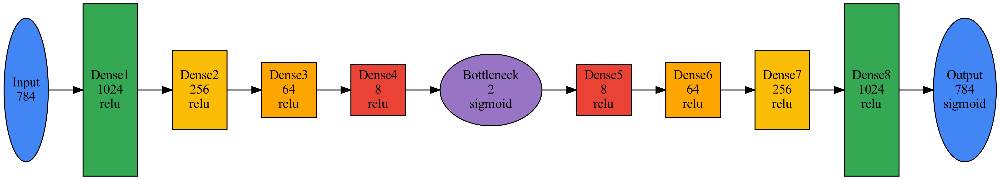

```{r setup-ae, include=FALSE}
require("keras")
require("ggplot2")
# require("tidyverse")
# require("h2o")
require("reticulate")
# specify the directory of your conda environment, you need to have python installed in order to implement keras package
# use_python("/Users/alexyoung/anaconda3/bin/python3", required=TRUE)
use_python("/Users/alexyoung/anaconda3/bin/python3", required=TRUE)
```

## Autoencoders (AEs)

### Introduction 

In each of the previously discussed manifold learning techniques, we have never made an attempt to explicity model the manifold mapping (or its inverse). Rather, we have focused on methods which recover lower-dimensional representations of the data assuming certain properties of the manifold map (e.g. isometry) and its preimage (convexity).  As a result, the journey from high-dimensional data to lower-dimensional representations has been a one-way trip.

Suppose now, that we take a more ambitious approach and try to model the manifold mapping and its inverse.  In practice, we know nothing about these functions -- their mere existence is assumed via the manifold hypothesis -- but at minimum we can expect them to be complicated nonlinear functions.   Enter autoencoders (AEs) which are specially designed neural networks that simultaneously model the manifold map and its inverse.  

Generally, an autoencoder is comprised of three main components.

1) **Encoder**: A neural network $\mathcal{E}(\vec{x})$ that compresses the input $\vec{x}$ into a latent representation. The encoder is acting like the inverse manifold map.

2) **Latent Space**: The reduced dimensionality representation, often denoted as $\vec{z}$, where $\vec{z} = \mathcal{E}(\vec{x})$.

3) **Decoder**: A neural network $\mathcal{D}(\vec{z})$ that aims to reconstruct the original input from the latent representation. This function acts like the manifold map.

```{r, echo = F, fig.align='center',fig.cap="Informal schematic of an autoencoder. The encoder and decoder at neural networks which map the original data into a lower dimensional latent space."}
knitr::include_graphics("../images/autoencoder_vertical.png")
```
### Neural networks: design and training

In their simplest form, neural networks iterate between affine transformations and elementwise nonlinear operations. If $\vec{x}\in\mathbb{R}^d$ is the input to a neural network, the affine transformation is determined by the equation ${\bf W}\vec{x}+\vec{b}$ where ${\bf W}\in\mathbb{R}^{k_1\times d}$, called weights, and ${\bf b}\in\mathbb{R}^{k_1}$, called the bias, are tuneable parameters. We then apply a nonlinear function, $\sigma_1:\mathbb{R}\to \mathbb{R}$, to ${\bf W}\in\mathbb{R}^{k_1\times d}$ resulting in a $k_1$ dimensional vector, $\sigma_1\left({\bf W}\in\mathbb{R}^{k_1\times d}\right)$ where the application of $\sigma_1$ is interpreted elementwise. The nonlinear function is also called an activation. Together, the affine transformation and nonlinear transformation are called a layer of the network with width $k_1$ reflecting the dimension of the output of the layer.

We can then iterate this idea, using the output of the previous layer as the input to the subsequent layers. In practice, we are free to choose the number of layers (depth of the network) and the width and activation within each layer providing innumerable configurations.  Choosing the structure of the network  -- its architecture -- has an enormous impact on how well this model can perform as a method of dimension reduction. Given the importance of these choices, building a neural network can appear overwhelming.  

And while there is still some art to the practice there are several conventions specific to autoencoders which offer guidance. First, we want to compress our high dimensional data into a lower dimensional space. To this end, we'll have an internal layer which maps to a lower dimensional space, referred to as the bottleneck. We refer to all layers between the input and the bottleneck as the encoder. The layers following the bottleneck then map back to the original high dimensional. We call this portion of the network the decoder  By convention, the network is symmetric around the bottleneck so the encoder and decoder have the same number of layers with widths in the opposite order.  See the MNIST example below for a specific case.

There are also other data specific insights from geometric deep learning that motivate more complicated neural network architecture beyond the traditional, dense, feed-forward approach we have outlined here.  For now, we'll focus common activations and methods for training the model (tuning the weights and biases in layers) to accomplish dimension reduction. 


#### Activation Functions

Activation functions play a vital role in neural networks, determining the output of a neuron based on its input. They introduce non-linear properties into the network, enabling it to learn from the error and make adjustments, which is essential for learning complex, nonlinear patterns.

Two common activation functions we can choose from.

1) **Sigmoid (Logistic) Function:** 

Equation: $f(x) = \frac{1}{1 + e^{-x}}$

Range: Between 0 and 1

Pros: Smooth gradient, preventing "jumps" in output values

Cons: Can cause vanishing gradient problems in deep networks

2) **Rectified Linear Unit (ReLU) Function:** 

Equation: $f(x) = max(0, x)$

Range: From 0 to infinity

Pros: Helps mitigate the vanishing gradient problem, leading to faster convergence

Cons: Neurons can sometimes "die", especially with a large learning rate

There are many other choices, but the ReLu activation is a fantastic first choice since it results in a network which can be trained more easily.  

#### Training

At its core, an autoencoder seeks to learn a compressed, efficient representation of input data by nonlinearly encoding the data into a lower dimension space and subsequently decoding it to reconstruct the original data [@NN]. This translate the training of a neural network into a self-supervised problem, wherein we want to approximate $\vec{x}$ by its reconstruction $\mathcal{D}\left(\mathcal{E}(\vec{x})\right).$  The primary objective during the training phase of an autoencoder is to minimize the reconstruction error, often quantified using metrics such as Mean Squared Error (MSE) between the input data and its reconstructed counterpart. Mathematically, this gives rise to the loss function $$L(\theta_e,\theta_d) =  \frac{1}{N}\sum_{i=1}^N\|\vec{x}_i - \mathcal{D}_{\theta_d}\left( \mathcal{E}_{\theta_e}(\vec{x_i})\right)\|^2.$$ Here $\theta_e$ and $\theta_d$ are the weights and biases of the encoder and decoder respectively.  

Importantly, since the network is comprised of interated affine transformations and nonlinear operations, it is a differentiable function of its parameters.  Computing these derivatives is call backpropogation in the ML literature an relies on repeated applications of the chain rule. With gradients in hand, gradient based optimization is a natural choice to tuning the paramters of the model to minimize the MSE.  At present, the most common choice of gradient based optimization is an algorithm called Adam [@adam_sgd] which uses an accelerated verion stochastic gradient descent to fit the autoencoder. The details of Adam and stochastic gradient descent to the curious reader. 

Once the autoencoder has been trained and we have identified optimal parameters, we can use the encoder for dimension reduction.  As a motivating example, let's revisit MNIST.


### MNIST Example

Compared to other manifold learning methods we have introduced, the implementation and training of an Autoencoder is much more complicated as we've outlined above. Here, we focus again on MNIST.  Following the setup of others methods, we continue to flatten each $28\times 28$ image into a $784$-dimensional vector, but we take one more step. Pixels intensities take values in the interval [0,255], which we divide by 255 so that every entry is between zero and one.  We then apply the following dense neural network, which we train on the full MNIST data set. This network has 10 layers (we don't count the input layer). All layers use a ReLu activation except to the last layer of the encoder (so the bottleneck is in $[0,1]^2$) and the output (so that pixel itensities in the reconstruction are bounded between [0,1] matching the division by 255 done in preprocessing)

```{r, echo = F, fig.align='center',fig.cap="A deep, dense neural network for modeling MNIST data"}

```

Between the encoder and decoder, this model has 1,892,954 parameters, which we train via the Adam optimizer [@adam_sgd] using 200 epochs, batch size = 256, and a 80\%/20\% test/train split. After training, we can run each image through the encoder portion of the network to view where each image is mapped in the latent space.  As we can see from the image below, the neural network does a far better job of separating the images of different digits into separate groups.

```{r, echo = FALSE, fig.cap="Latent space representation of MNIST",fig.align='center',fig.width= 8}
knitr::include_graphics("../images/MNIST_ae_latent_space.pdf")
```

For comparison, here is the two-dimensional configuration of points obtained by PCA.


```{r keras_mnist_pca, echo = FALSE, cache = TRUE, fig.align='center',fig.cap="2D Representation of MNIST via PCA",fig.width=8}
require("keras")
mnist <- dataset_mnist()
train_images <- mnist$train$x
train_images <- array_reshape(train_images, c(nrow(train_images), 28*28))
train_images <- train_images / 255
labels_train <- mnist$train$y
pca_result <- prcomp(train_images)

# Extract the scores of the first two principal components
scores <- as.data.frame(pca_result$x[, 1:2])
colnames(scores) <- c("PC1", "PC2")
p <- ggplot(scores, aes(x = PC1, y = PC2, color = labels_train)) +
  geom_point(alpha = 0.6) +
  labs(title = "PCA", x = "PC1", y = "PC2", color="response") +
  theme_minimal()
p
```

#### Strengths and weaknesses

Neural networks are incredibly powerful tools for approximating nonlinear functions, so it is natural to hope that we might be able to approximate the manifold map using the decoder. Like previous methods, however, the lower dimensional space is not unique so we can hope to learn the manifold map up to some invertible transformation without a lot more information. Furthemore, AEs are focused on minimizing the reconstruction error rather than directly using properties of the manifold containing our data. The greedy gradient based approach means we relinquish control on which relationships within the dataset we would like to preserve and what or relationships that might exist between the bottleneck and manifold (isometry for example). In particular, there are no constraints that an AE prioritize the neighborhood structure between points. Samples $\vec{x}_i$ and $\vec{x}_j$ may be close originally, but the nonlinear nature of a neural network could result in $\mathcal{E}(\vec{x}_i)$ and $\mathcal{E}(\vec{x}_j)$ being far apart.

Nonetheless, the utility of Autoencoders has been demonstrated in a wide array of applications beyond dimensionality reduction. Anomaly detection, denoising [@DenoiseAE], and generative modeling [@VAE] are a few exciting extensions and applications. The capacity of an AE to generalize and generate new samples is by far its greatest strength, which delineates it from the preceding methods. LLMs and many other generative models are based on the self-supervised approach central to AEs. The specifics that go into training state of the art language models are beyond the scope of this text. However, a basic mechanism is built into the decoder portion of the network.  In principle, we could choose a point in the bottleneck (perhaps one between the lower-dimensional representation of two sample arising from the encoder), then pass it through the decoder to generate a new data point. For an iteractive demonstration of this idea applied to MNIST, check out this [java applet](https://n8programs.com/mnistLatentSpace/).


