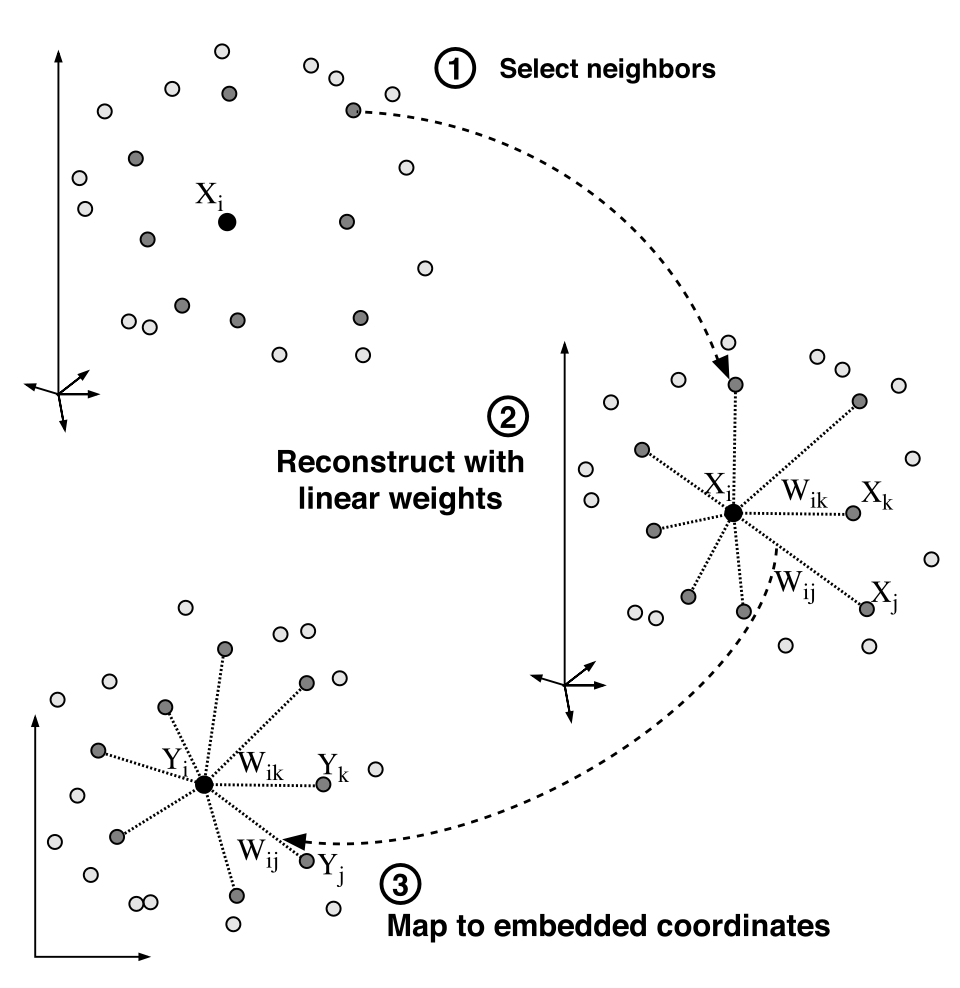

```{r, include=FALSE}
myColorRamp <- function(colors, values) {
    v <- (values - min(values))/diff(range(values))
    x <- colorRamp(colors)(v)
    rgb(x[,1], x[,2], x[,3], maxColorValue = 255)
}
```

## Locally Linear Embeddings (LLEs)

### Introduction

Locally linear embedding (LLE) is an unsupervised learning algorithm first introduced in 2000 by Sam T. Roweis and Lawrence K. Saul [@lle]. In the original four-page paper, the two authors introduced the LLE algorithm and demonstrated its effectiveness in dimensional reduction, manifold learning, and in handling real-world high-dimensional data. Unlike clustering methods for local dimensional reduction, LLE maps its inputs into a single global coordinate system of lower dimensionality, and its optimizations do not involve local minima. By exploiting the local symmetries of linear reconstructions, LLE is able to learn the global structure of nonlinear manifolds, such as those generated by images of faces or documents of text. Thanks to its great mathematical properties and relatively low computing cost (compared to other manifold learning methods, like ISOMAP), LLE quickly became attractive to researchers after its emergence due to its ability to deal with large amounts of high dimensional data and its non-iterative way of finding the embeddings [@lle_survey]. Compared to ISOMAP and some other previous manifold learning methods, LLE is computationally simpler and can give useful results on a broader range of manifolds [@think_globally].

For dimensional reduction, most methods introduced before LLE need to estimate pairwise distances between even two remote data points, no matter it is the simple Euclidean distance (classical MDS) or more sophisticated manifold distance (ISOMAP). The underlying main idea of these methods is actually finding a configuration that recovers all pairwise distances of original data points as much as possible. LLE, however, is quite different from these previous methods as it focuses on preserving **locally linear relationships**. 

### Algorithm

LLE algorithm is actually built on very simple geometric intuitions. As explained in MDS Part, if we consider a small enough region on a manifold in $D$ dimensional space, in most cases, it can be regarded as a $d$ dimensional hyperplane ($d \ll D$). LLE also makes use of this intuition and assumes that the whole manifold consist of numerous $d$-dimensional patches that have been stitched together. Assuming that there exists sufficient data (data points are compact), it is reasonable to expect that each data point and its neighbors lie on or close to a locally linear patch of the manifold. 

Following this idea, LLE approximates each data point by a weighted linear combination of its neighbors and proceeds to find a lower-dimensional configuration of data points so that the linear approximations of all data points are best preserved.

Specifically speaking, LLE algorithm consists of three steps. The initial step involves selecting a certain number of each data point's nearest neighbors based on Euclidean distance. Following this, the second step calculates the optimal reconstruction weights for each point using its nearest neighbors. The final step carries out the embedding while maintaining the local geometry depicted by the reconstruction weights.


#### Construct Neighborhood Graph

This step is actually very similar to that of ISOMAP. The process of finding neighbors in LLE is typically conducted using grouping methods like k-nearest neighbors (KNN) or selecting neighbors within a fixed radius ball ($\epsilon$-neighborhoods), based on the Euclidean distance for each data point, in the provided data set. The KNN method is predominantly utilized for its straightforwardness and ease of implementation. The following explanations are based on KNN method.

Denote $N$ data points in original $D$ dimensional space as $\vec{x}_1, \vec{x}_2, \dots, \vec{x}_N \in \mathbb{R}^D$. For a point $\vec{x}_i, \quad 1 \leq i \leq N$, its neighbor set is defined as $N_i^k \subseteq \{1, 2, 3, \dots, i-1, i+1, \dots, N \}$, where $N_i^k$ can also be called as the indices of $k$ nearest neighbors of $\vec{x}_i$. The tuning parameter $k$ is chosen small enough so that the patch around $\vec{x}_i$ is flat. However, $k$ should also be strictly larger than $d$ so as to let the algorithm work. 

As we can tell from these, LLE works well only if data points are dense and hopefully evenly distributed, which will be explained in detail in later examples. The parameter tuning of the appropriate number of neighbors, $k$, faces challenges of complexity, non-linearity, and diversity of high-dimensional input samples. A larger $k$ value might cause the algorithm to overlook or even lose the local nonlinear features on the manifold. This issue is exacerbated as neighbor selection, typically based on Euclidean distance, can result in distant neighbors when considering the intrinsic geometry of the data, akin to a short circuit. Conversely, an overly small $k$ value may lead the LLE algorithm to fragment the continuous manifold into isolated local pieces, losing global characteristics. 


#### Reconsruct with Linear Weights

As put before, we try to reconstruct each $\vec{x}_i$ using an almost convex weighted combination of its neighbors. The respective weights of all its neighbors $\vec{x}_j, \; j \neq i$ for each $\vec{x}_i$ is quite essential in the later reconstruction of the underlying intrinsic configuration, as we consider these weights to remain invariant before and after mapping. 

To explain it in mathematical formulas, the approximate of $\vec{x}_i$: $\tilde{x}_i$ is defined as $\tilde{x}_i = \sum_{j=1}^N w_{ij} \vec{x}_j$. There are two constraints for this formula: First, $w_{ij} \equiv 0$, if $j \notin N_i^k$ (consistent with the assumption of $k$ nearest neighbors); Second, the sum of weights for each $\vec{x}_i$ is always zero, i.e., $\sum_{j=1}^N w_{ij}=1$. 

Then, the problem of finding the optimal $w_{ij}, \; 1 \leq i,j \leq N$ is equivalent to solving the following constrained Least Squares problem for $\forall 1 \leq i \leq N$:

<span id="eq:opt_prob"> (1) </span>
$$
\begin{aligned}
& \min \left\| \vec{x}_i-\sum_{j \in N_i^k} w_{i j} \vec{x}_j\right\|^2 \\
& \text { s.t. } \quad \sum_{j \in N_i^k} w_{i j}=1 .
\end{aligned}
$$

It is worth noting that the weights can be negative theoretically, though in practice, we don't expect that to happen.

**Invariance to Rotation, Rescaling and Transaction**

Define $\epsilon(w) = \sum_{i=1}^N \left\| \vec{x}_i-\sum_{j \in N_i^k} w_{i j} \vec{x}_j\right\|^2$, which is the cost function. 

1) $\epsilon(w)$ is unchanged by rotation or rescaling by common factor

Actually $\sum_{i=1}^N \left\| a \text{U} \vec{x}_i-\sum_{j \in N_i^k} w_{i j} a \text{U} \vec{x}_j\right\|^2 = a^2 \epsilon(w)$, where $a$ is a non-zero scaler and $\text{U}$ is an orthonormal matrix.

2) $\epsilon(w)$ is unchanged by transactions

Thanks to the constraint that $\sum_{j=1}^N w_{ij}=1$, for any transaction $\vec{x}_i \rightarrow \vec{x}_i + \vec{y}$, the cost function does not change.

$$\sum_{i=1}^N \left\| (\vec{x}_i + \vec{y}) -\sum_{j \in N_i^k} w_{i j} (\vec{x}_j + \vec{y}) \right\|^2 = \sum_{i=1}^N \left\| \vec{x}_i-\sum_{j \in N_i^k} w_{i j} \vec{x}_j\right\|^2 = \epsilon(w)$$

From the expressions, we develop a strategy that optimizes one row of matrix $w$ at a time. Now let's try to rewrite $\epsilon(\vec{w}_i)=\left\| \vec{x}_i-\sum_{j \in N_i^k} w_{i j} \vec{x}_j\right\|^2$. 

\begin{align}
\epsilon(\vec{w}_i) &= \left\| \vec{x}_i-\sum_{j \in N_i^k} w_{i j} \vec{x}_j\right\|^2 \\
& = \left[ \sum_{j=1}^N w_{ij} (\vec{x}_i - \vec{w}_j) \right]^T \left[ \sum_{l=1}^N w_{il} (\vec{x}_i - \vec{w}_l) \right]^T \\
& = \sum_{j=1}^N \sum_{l=1}^N w_{ij} w_{il} (\vec{x}_i -\vec{x}_j)^T (\vec{x}_i - \vec{x}_l) \\
& = \vec{w}_i^T G_i \vec{w}_i
\end{align}

$\vec{w}_i^T = (w_{i1}, w_{i2}, \dots w_{iN})$ is the $i^{th}$ row of W. Here $G_i \in \mathbb{R}^{N \times N}$, where entry $G_{i}(j.l), \; 1 \leq j,l \leq N$ can be represented as:

$$
G_{i}(j,l) = 
\begin{cases}
(\vec{x}_i - \vec{x}_j)^T (\vec{x}_i - \vec{x}_l) & j,l \in N_i^k \\
0 & j \; or \; l \notin N_i^k
\end{cases}
$$

The $(j,l)$ entry of $G_i$ is actually the inner product of $\vec{x}_j$ and $\vec{x}_l$ when centered around $\vec{x}_i$. From this expression, we know that actually $G_i$ is a sparse matrix and can be reduced to a compact matrix $\tilde{G}_i \in \mathbb{R}^{k \times k}$ that eliminates those empty columns and rows. 

\begin{align}
\tilde{G}_i & = (\vec{x}_{i[1]} - \vec{x}_i, \dots, \vec{x}_{i[k]} - \vec{x}_i)^T (\vec{x}_{i[1]} - \vec{x}_i, \dots, \vec{x}_{i[k]} - \vec{x}_i) \\
& = Q_i^T Q_i
\end{align}

where $[1]$ denotes the first entry in $N_i^k$. So $\tilde{G}_i$ is actually a real symmetric and positive semi-definite matrix. 

Now let's go back to deal with the optimization function --- Equation <a href="#eq:opt_prob">1</a> can be solved with Lagrange multiplier given that it has only equality constraints. (More details about the use of Lagrange multiplier can be found in [Lagrange multiplier]<https://en.wikipedia.org/wiki/Lagrange_multiplier>)

Optimizing Equation <a href="#eq:opt_prob">1</a> is equivalent to minimizing (for $\forall 1 \leq i \leq N$) 
$$
f(\vec{w}_i, \lambda) = \vec{w}^T_i G_i \vec{w}_i - \lambda (\vec{w}^T_i \mathbf{1}_k -1)
$$
which has the result:
$$
\vec{w}_i^{\star} = \frac{\tilde{G}^{-}_i \mathbf{1}_k}{\mathbf{1}^T_k \tilde{G}^{-}_i \mathbf{1}_k}
$$

**Complement:**

As discussed before, we can only proof that $\tilde{G}_i$ is positive semi-definite, however, we cannot ensure that it is positive definite, which means $\tilde{G}_i$ is not necessarily invertible. That is why we use the generalize inverse sign here. In practice, it can be done through performing SVD on $\tilde{G}_i$ and select the first few large singular values and eliminate the rest. Then when computing $\tilde{G}^{-}_i$, just do the reciprocal of these retained singular values. 

Actually $\tilde{G}_i$ only has $d$ (the intrinsic original dimension if you forget) relatively large eigenvalues. The rest are either very small or zeros. So it is very likely that $\tilde{G}_i$ is singular, making the computation result highly unstable. In {@think_globally}, the authors proposed to address this issue through regularizing $\tilde{G}_i$.

$$
\tilde{G}_i \leftarrow \tilde{G}_i+ \left(\frac{\Delta^2}{k}\right) \operatorname{Tr}\left(\tilde{G}_i\right) \mathbf{I}
$$
Here $Tr(\tilde{G}_i)$ denotes the trace of $\tilde{G}_i$ and $\Delta \ll 1$.


#### Embedding

In the previous step, we have recovered the optimal weight matrix 

$$
\mathbf{W} =
\left(\begin{array}{l}
\vec{w}_1^T \\
\vdots \\
\vec{w}_N^T
\end{array}\right)
$$


The optimal weights $\mathbb{W}$ reflects local, linear geometry around each $\vec{x}_i$, thus if the configuration $\vec{y}_1, \vec{y}_2, \dots, \vec{y}_N \in \mathbb{R}^d$ are the lower dimensional representation, they should also "match" the local geometry.

Following this idea, the objective function is:

<span id="eq:embedding"> (2) </span>
$$
\begin{aligned}
& \underset{\mathbf{Y}}{\text{argmin}} \sum_{i=1}^N \left\| \vec{y}_i - \sum_{j=1}^{N} w_{ij} \vec{y}_j^T \right\|^2 \\
= & \underset{\mathbf{Y}}{\text{argmin}} \sum_{i=1}^N \left\| \sum_{j=1}^N w_{ij} (\vec{y}_i -  \vec{y}_j)^T \right\|^2 \\
= & \underset{\mathbf{Y}}{\text{argmin}} \left\| \mathbf{Y - WY} \right\|_F^2 \\
= & \underset{\mathbf{Y}}{\text{argmin}} \left\| (\mathbf{I}_N - \mathbf{W}) \mathbf{Y} \right\|_F^2 \\
= & \underset{\mathbf{Y}}{\text{argmin}} \; \text{Tr} \left[ \mathbf{Y}^T (\mathbf{I}_N - \mathbf{W})^T (\mathbf{I}_N - \mathbf{W}) \mathbf{Y} \right]
\end{aligned}
$$
where $\mathbf{Y}=(\vec{y}_1 | \vec{y}_2 | \dots | \vec{y}_N)^T$

There are two constraints:

a) $\mathbf{1}_N^T \mathbf{Y} = \vec{0}$. This forces $\vec{y}$ to be centered

b) $\frac{1}{N} \mathbf{Y}^T \mathbf{Y} = \mathbf{I}_d$. This fixes rotation and scaling.

**Key Observation**

Considering the final expression of Equation <a href="#eq:embedding">2</a>, the optimization function is now equivalent to finding $\vec{y}_i$s that minimizes $\mathbf{Y}^T (\mathbf{I}_N - \mathbf{W})^T (\mathbf{I}_N - \mathbf{W}) \mathbf{Y}$.

Here we introduce $\mathbf{M} = (\mathbf{I}_N - \mathbf{W})^T (\mathbf{I}_N - \mathbf{W})$, which is a positive semi-definite matrix. Since $\mathbf{M} \mathbf{1}_N = (\mathbf{I} - \mathbf{W})^T (\mathbf{1}_N - \mathbf{W} \mathbf{1}_N) = \vec{0}$, $\mathbf{1}_N$ is an eigen-vector of $\mathbf{M}$ with eigenvalue zero.

$$
\begin{aligned}
\mathbf{Y}^T (\mathbf{I}_N - \mathbf{W})^T (\mathbf{I}_N - \mathbf{W}) \mathbf{Y} 
= \mathbf{Y}^T \mathbf{M} \mathbf{Y}
\end{aligned}
$$
From constraint (b), we know that columns of $\mathbf{Y}$ are orthogonal to each other. As a result, this whole problem can be simplified to finding the eigen-vectors of $\mathbf{M}$ with the smallest eigenvalues. 

Compute eigen-vectors with the smallest $d+1$ eigenvalues $0=\lambda_1 \leq \lambda_2 < \dots < \lambda_{d+1}$, eliminate $\mathbf{1}_N$ (the first one). The remaining $d$ vectors are respectively $\vec{v}_2, \vec{v}_3, \dots \vec{v}_{d+1} \in \mathbb{R}^N$. So $\mathbf{Y} = (\vec{v}_2 | \vec{v}_2 | \dots | \vec{v}_{d+1})$, we successfully recover the corresponding $\vec{y}_1, \vec{y}_2, \dots, \vec{y}_N \in \mathbb{R}^d$. 

**An illustration of the algorithm**

In the original paper [@lle], the authors provide a very intuitive plot that summarizes the above three steps. 

<p style="text-align:center;">
{width=40% height=40%} </p>


**Parameter Tuning**

There are two parameters to tune in LLE, i.e. (the number of neighbors: $k \,$; the dimension of the recovered configuration: $d \,$). 

1) For selection of $d$, we usually use a reverse scree plot and find the elbow point. It is worth noting that we are choosing the smallest $d+1$ eigenvalues and compute their corresponding eigen-vectors here. Since the eigen-vectors and eigenvalues of a particular matrix is super sensitive to any sort of noises or perturbations, especially for those small eigenvalues, it is hard to accurately derive the corresponding eigen-vectors $\vec{v}_2, \dots, \vec{v}_{d+1}$. This is called ill-conditioned eigen-problem.

2) Choose the optimal $k$

LLE seeks to preserve local structure through nearest neighbor connections. This is the key point to LLE. As a result, we may use the neighbor set of the original $\vec{x}_1, \vec{x}_2, \dots, \vec{x}_N \in \mathbb{R}^D$ and $\vec{y}_1, \vec{y}_2, \dots, \vec{y}_N \in \mathbb{R}^d$ as a criteria.

As explained before, we use $N_i^k$ to denote the indices of k-nearest neighbors to $\vec{x}_i$. Similarly, we can also use $V_i^k$ to denote the indices of k-nearest neighbors to $\vec{y}_i$. They should be as close as possible.

So our objective function here is:
$$
Q(k)= \frac{\sum_{i=1}^N \left| N_i^k \cap V_i^k \right|}{Nk}
$$
Plot $Q(k)$ against $k$, select $k^{\star}$ where the increase of $Q(k)$ becomes negligible.

### Strengths and Weaknesses of LLE

#### Strengths

1) **High Computation Efficiency**

The low computation cost of LLE algorithm may be its most shinning advantage over other manifold learning methods, and it is actually one of its biggest selling point when it was first introduced. The LLE algorithm Involves solving a sparse eigen problem, with computational complexity of roughly $O(N^2 d^2 + N d^3)$ where $N$ is the number of data points and $d$ is the dimension of the recovered configuration.
 
In comparison, ISOMAP requires computing shortest paths between all pairs of points, which is typically done using Dijkstra's or Floyd-Warshall algorithm, leading to a complexity of $O(N^2 log N)$ or $O(N^3)$ respectively. Then, it involves eigen decomposition similar to classical MDS which is $O(N^3)$. 

In practice, $d \ll N$, hence the computation cost of LLE is lower than that of ISOMAP in most cases.

2) **Few parameters to tune**

There are only two parameters to tune, respectively the number of neighbors included in the map:  $k$, and the dimensional of the original configuration: $d$. In addition, there exist clear methods to find the optimal $k$ and $d$, as stated in the previous part. This makes LLE algorithm easy to find the optimal parameters.


#### Weaknesses

1) **Sensitivity to tuning parameters** 

The result of LLE is quite sensitive to its two control parameters: the number of neighbors $k \,$ and the dimensional of the original configuration: $d$.

Here we use the Swiss Roll example to illustrate this. LLE is optimal at $k=45$. However, when $k=40$, the recovered lower-dimensional configuration is wrong (Green points and yellow points overlap, which is not the case in Swiss Roll); and when we slightly increase $k$ to 50, the recovered two-dimensional expression is not necessarily a rectangle.


2) **Vulnerable to sparse or unevenly-distributed samples**

The vulnerability towards sparsity and uneven distribution exists in almost all manifold learning methods, including ISOMAP, as we have illustrated in the previous section. LLE is not immune to this either. When a data set is unevenly distributed, since LLE relies on the original Euclidean distance metric, it tends to select neighbors from a singular direction where these neighbors are densely clustered. Clearly, using these selected neighbors to reconstruct the reference point results in significant redundancy in that specific direction. Concurrently, essential information from other directions or regions is not retained for the reconstruction of the reference point. As a result, these selected neighbors are inadequate for accurately representing and reconstructing the reference point. Consequently, much of the intrinsic structure and internal features will be lost after dimension reduction using LLE.


3) **Sensitivity to noise**

LLE is extremely sensitive to noise. Even a small noise would cause failure in deriving low dimensional configurations. Justin Wang, et.al utilize various visualization examples to illustrate this drawback in their paper [@llenoise], you may take a look if you are interested. Various algorithms have been developed to address this issue, i.e., Robustly Locally Linear Embedding (RLLE) [@RobustLLE], and Locally Linear Embedding with Additive Noise (LLEAN) [@llenoise]. The former works well when outliers exist, while the latter has a satisfactory performance when the original points are distorted with noises.
